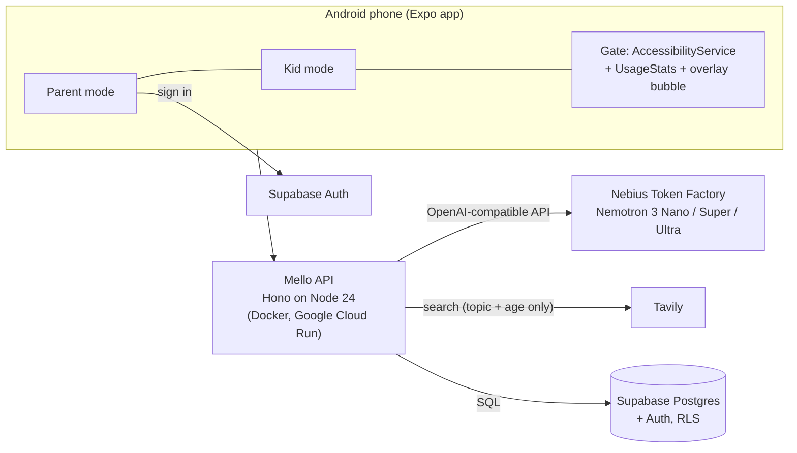

<p align="center"></p>

# Mello

**A private AI helper that lives on your kid's phone and does what you ask. It runs on NVIDIA Nemotron through Nebius Token Factory.**

Before TikTok opens, Mello asks your kid to read for a few minutes, or to finish the video or podcast you assigned. Then it checks they actually did it. You manage it by chatting with an agent ("Make Sara read 10 minutes before YouTube, and find her a short video about volcanoes"). Every week Mello tells you, in plain words, how your kid's week went.

Mello is a calm giant tortoise. Its motto is *small steps, big journeys*.

- **Try it:** [download the Android APK](https://github.com/Sppdd/mello/releases/latest). The testing steps and demo accounts are in [docs/SUBMISSION.md](docs/SUBMISSION.md#testing-instructions).
- **Hosted API:** `https://mello-api-69541089425.asia-northeast1.run.app/health`
- **Hackathon:** Nebius x NVIDIA Global AI Hackathon, *Best Apps and Agents* track.

---

## The problem

- Kids get endless, algorithmic feeds. Parents get an on/off switch. Screen-time tools block apps, but they can't make the time *worth* something, and they can't tell whether a kid really read or just left a page open.
- Parents are busy. Setting rules in a settings maze each evening doesn't happen, and nobody reads usage charts.
- Families don't want their kids' data in a big consumer AI. A "smart" parental app usually means sending a child's behaviour to a model provider that may train on it.

## What Mello does

| | |
|---|---|
| **Reading gate** | Pick apps (TikTok, Instagram, YouTube…). When your kid opens one, Mello opens instead: read N minutes, pass a 3-question quiz written from *the exact pages they read*, then the app unlocks. |
| **Tasks that count only when they happen** | Assign a YouTube video, a podcast, an article, your own voice recording, or time in a reading app. The timer counts only while the media is playing or the page is on screen and the phone is held. |
| **Find something to learn** | Type a topic ("volcanoes", "fractions", "kindness"). Mello searches the web with **Tavily**, and **Nemotron Nano** checks every result for your kid's age before you see it. Tap a result to assign it. |
| **Parent agent** | Chat in plain language: rules, limits, bedtime, tasks, spoken messages to the kid's phone, reports, and sourced answers to parenting questions. It is a tool-calling agent on **Nemotron Super**. |
| **Weekly insight** | **Nemotron Ultra** reasons over a week of reading, quiz results, tasks, limits and alerts. It writes a headline, wins, things to watch, and next steps you can tap to have the agent carry out. |
| **Daily limits and bedtime** | Per-app minutes per day, with a floating "time left" bubble. Bedtime blocks everything except allowed apps. Calls and emergency apps always work. |
| **Messages from home** | Type a message and Mello speaks it on your kid's phone, or record your own voice. |
| **Just me (self mode)** | The same coach, for your own phone: focus sessions in reading or podcast apps, reflections, streaks and a private companion chat. See [docs/SELF_MODE.md](docs/SELF_MODE.md). |
| **Hard to switch off** | If the gate, overlay or usage access is turned off, the parent gets an alert. Signing a kid's phone out needs the parent's password or approval. |

## How the AI is used (NVIDIA Nemotron on Nebius Token Factory)

Every model call is a runtime call to the **Nebius Token Factory** OpenAI-compatible API (`apps/api/src/llm.ts`). Each job uses the Nemotron 3 size that fits it, so the app stays fast and the credits go further:

| Model (Token Factory id) | Role | Used for | Code |
|---|---|---|---|
| `nvidia/NVIDIA-Nemotron-3-Nano-30B-A3B` | **fast** | Kid-safety screen of every web result (strict JSON schema, fails closed), reflection questions and replies | `tavily.ts`, `coach.ts` |
| `nvidia/nemotron-3-super-120b-a12b` | **agent** | The parent agent and self coach (multi-step tool calling over about 20 tools), reading-quiz generation with strict JSON schema output | `agent.ts`, `coach.ts`, `toolLoop.ts`, `challenge.ts` |
| `nvidia/Nemotron-3-Ultra-550b-a55b` | **reasoning** | Weekly insight: reasons over a week of aggregates and returns structured findings plus agent-ready next steps | `insight.ts` |

`GET /health` reports the live model map. Each role can be overridden with `NEBIUS_MODEL_FAST`, `NEBIUS_MODEL_AGENT` and `NEBIUS_MODEL_REASONING`.

**Where Token Factory sped up the work:** the OpenAI-compatible endpoint meant the official `openai` SDK worked unchanged. Tool calling and `json_schema` structured output work on all three Nemotron sizes, so moving from a general model to a three-tier Nemotron setup changed one file. Structured output removed a whole class of quiz bugs (wrong number of choices, missing answer index) that JSON mode alone allowed.

## Tavily

Tavily is called only by the API (`apps/api/src/tavily.ts`), so the key never reaches a phone. It is used two ways:

1. **`find_content` / `POST /parent/kids/:id/content-ideas`:** finds real, current videos (YouTube), articles or podcast episodes on a topic. Social feeds, forums and plain-`http` pages are dropped. Then Nemotron Nano marks each result safe or not for the kid's age, with a one-line reason for the parent and a suggested time. Anything without a verdict is dropped.
2. **`search_web`:** answers parenting questions ("how much screen time for an 8-year-old?") from current sources. The agent replies briefly and cites its sources.

Only the topic or question and an age leave the server. Names, apps and usage are never sent to Tavily.

## Privacy

- **Private inference:** prompts go to Nebius Token Factory, not to a consumer chatbot. Run Mello's Token Factory account with **Zero Data Retention** turned on (account settings). Prompts and outputs are then not stored after each request and never used for training ([Token Factory legal guide](https://docs.tokenfactory.nebius.com/legal/legal-quick-guide)). Without it, Token Factory may keep traffic to train smaller speculative-decoding models.
- **Minimal data:** Mello never sees screen content. The models get counts and minutes, app names, the text of the pages a kid read (for the quiz), and the kid's first name.
- **Family-owned data:** data lives in the family's Postgres (Supabase), with row-level security on every table (`apps/api/sql/002_supabase.sql`, `004_supabase_self.sql`). Self-mode users can delete their history from the app.
- **On-device enforcement:** the gate, timers and limits run on the phone (an Android AccessibilityService plus UsageStats), so blocking works offline.
- **Secrets stay out of git.** Only `.env.example` is committed.

## Architecture



```
apps/api       Hono API: pairing, rules, tasks, limits, quizzes, agent, coach, insight, search
apps/mobile    Expo app (expo-router, src/app) with parent, kid and self modes
apps/mobile/modules/mello-blocker   native module: Android AccessibilityService gate, focus lock, usage, overlay
packages/shared   zod schemas, gate logic and Mello's character, shared by the API and the app
```

## Run it

Requirements: Node 24, and Android Studio (SDK, plus an emulator or a phone with USB debugging).

### API

```sh
npm install
cp .env.example .env     # set NEBIUS_API_KEY and TAVILY_API_KEY; Supabase is optional locally
npm run api              # http://localhost:8787 (local PGlite database if DATABASE_URL is unset)
npm test                 # API and gate-logic tests
```

With Supabase, run `apps/api/sql/001_core.sql`, `002_supabase.sql`, `003_self.sql` and `004_supabase_self.sql` once, in that order. Then set `DATABASE_URL`, `SUPABASE_URL` and `SUPABASE_PUBLISHABLE_KEY`.

Docker: `docker build -f apps/api/Dockerfile -t mello-api . && docker run -p 8787:8787 --env-file .env mello-api`. Cloud deployment steps are in [docs/DEPLOY.md](docs/DEPLOY.md).

### Mobile

The app needs a development build because of the native module; Expo Go won't work.

```sh
cd apps/mobile
# apps/mobile/.env: EXPO_PUBLIC_API_URL, EXPO_PUBLIC_SUPABASE_URL, EXPO_PUBLIC_SUPABASE_PUBLISHABLE_KEY
npx expo run:android                       # debug build on a connected phone or emulator
# release APK:
npx expo prebuild --platform android && cd android && ./gradlew :app:assembleRelease
```

For a phone on USB with a local API, run `adb reverse tcp:8787 tcp:8787` and use `EXPO_PUBLIC_API_URL=http://localhost:8787`.

### Try the flow
1. **Parent phone:** open Mello, choose **I'm the parent**, sign up, and create a family. Note the 6-digit code.
2. **Kid phone:** choose **This is my kid's phone** and enter the code. Turn on the Mello reading gate when asked (Settings → Accessibility), along with usage access.
3. **Parent:** open the kid and set their age. Under **Find something to learn**, search "volcanoes" and assign a video. Add a reading rule for YouTube. Tap **Get weekly insight**.
4. **Kid:** open YouTube. Mello opens instead. Watch the task or read, take the quiz, and YouTube opens.
5. **Parent → Ask Mello:** try "Find Sara a short video about the moon and make it a task before TikTok".

## Safety
- The phone app, dialer, emergency and Settings apps can never be blocked.
- If Token Factory is down, the quiz is skipped and reading time alone unlocks the app, so a kid is never stuck.
- Search results reach a parent only after the age check passes. They are never shown to the kid directly; a parent chooses what to assign.

## Known limitations
- Android only for now. The iOS gate needs Apple's Family Controls entitlement.
- Voice-message uploads are stored on the API container's disk, which is wiped on redeploy. Supabase Storage is next.
- A determined kid can still turn off the accessibility service in Settings. Settings stays open so a phone can't be bricked; the parent gets an alert instead.

## License

[MIT](LICENSE). The Mello character and art are original to this project.
